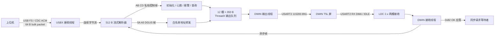

# CHPM USB CDC ACM → STM32 → DWIN 协议归档与链路审查

> 审查日期：2026-07-20  
> 目标工程：`projects/stm32f401-chpm`  
> MCU / RTOS：STM32F401CCU6 / ThreadX  
> 结论依据：当前 Keil 目标实际编译源码、DWIN 屏幕资料和用户对实机 CRC 的确认。本文没有修改固件，也没有烧录硬件。

## 1. 结论先行

当前主链路已经形成了较清楚的单向转发结构：



主路径方向是正确的：USB 接收、协议解析、DWIN 输出各有独立 ThreadX 线程，DWIN 接收使用循环 DMA，并有错误重启和统计字段。

当前最需要处理的不是“能不能通信”，而是“发生拥塞或错误时能不能知道”：

1. USB → DWIN 的活动转发存在静默丢包路径，上位机没有事务结果，无法判断屏幕是否真正收到。
2. `dwin_app.c`、`dwin_drv.c` 中仍有已编译的直接发送接口，会绕过主输出线程；同步请求又只接受 6 字节无 CRC 应答。
3. 私有协议的若干帧校验不完整，且可直接触发 MCU 复位、修改 Modbus 地址，控制边界偏宽。
4. DWIN 接收仍以 IDLE/20 ms 静默作为帧边界，两个连续帧可能合并，长帧或突发帧可能超过 256 字节 LDC 容量。
5. USBX 初始化错误、队列拒绝、UART 超时和 LDC 统计都没有进入统一健康状态；IWDG 当前关闭。

关于 CRC：用户已确认实机 CRC 正常。仓库中的 `43DWIN0611\T5LCFG.CFG` 是临时配置，不作为实机配置依据；本文只建议将临时和量产屏幕配置明确分开，避免以后误烧。

## 2. 审查范围与可信来源

### 2.1 当前活动源码

| 模块 | 主要文件 | 作用 |
|---|---|---|
| USBX CDC、私有协议、转发、ThreadX 任务 | `Core/Src/main.c` | 当前链路的核心实现 |
| USB 描述符 | `USBX/App/ux_device_descriptors.h/.c` | VID/PID、端点和产品字符串 |
| DWIN BSP 串口 | `user/bsp/bsp_uart.c` | USART2、DMA、IDLE、错误恢复 |
| DWIN 设备驱动 | `user/drivers/drv_dwin.c` | BSP 串口写、DMA数据送入 LDC |
| DWIN LDC 通道 | `user/ldc/dwin_ldc_channel.c` | 收包槽、静默提交、ACK 路由 |
| 旧 DWIN 公共接口 | `user/dwin/dwin_drv.c`、`dwin_app.c` | 同步写和直接发送；仍在目标中编译 |
| CRC | `user/services/data_utils.c` | `CRC16_Modbus()` |

`MDK-ARM/F4.uvprojx` 和 `scripts/validate_project.ps1` 表明以上文件均属于当前 Keil 目标；不能把 `user/dwin` 下的直接发送接口当成未编译遗留文件。

### 2.2 DWIN 资料

- `手册/DWIN/T5L_DGUS2应用指南_V65.pdf`
  - 第 5 页：UART2 DGUS 帧、0x80～0x83、CRC 和写应答。
  - 第 7 页：`0x0004 System_Reset`、`0x0084 PIC_Set`、UART2 CRC 状态。
  - 第 8 页：`0x00A0 WAE/蜂鸣器`。
- `43DWIN0611`、`43DWIN`：屏幕工程快照。其 `T5LCFG.CFG` 为临时文件，不代表板上运行配置。
- `CHPM通信协议.md`：早期设计说明。与当前源码存在差异，本文以当前源码为准。

## 3. 物理层与 USB 枚举合同

### 3.1 USB CDC ACM

| 项目 | 当前值 |
|---|---|
| USB 控制器 | STM32 USB OTG FS |
| 引脚 | PA11 / PA12 |
| VID | `0x0483`（十进制 1155） |
| PID | `0x5740`（十进制 22336） |
| 产品字符串 | `STM32 Virtual ComPort` |
| CDC 通知 IN | `0x82`，FS MPS 8 B |
| CDC 数据 IN | `0x81`，FS MPS 64 B |
| CDC 数据 OUT | `0x01`，FS MPS 64 B |
| 单次应用接收缓冲 | 64 B |
| USBX byte pool | 10 KiB |
| 分配给 USBX | 4 KiB |

CDC 的 64 字节只是 USB 包和单次读取大小，不是业务帧边界。业务帧允许跨多个 USB 包，也允许一个 USB 包携带多个业务帧；当前 512 字节流式解析器可以处理这两种情况。

### 3.2 DWIN UART2

| 项目 | 当前值 |
|---|---|
| MCU 外设 | USART2 |
| 引脚 | PA2 TX / PA3 RX，AF7 |
| 串口格式 | 115200，8N1，无流控 |
| RX DMA | DMA1 Stream5 / Channel4 |
| DMA 模式 | Circular |
| DMA 缓冲 | 128 B |
| 接收事件 | Receive-to-IDLE；关闭 DMA half-transfer 中断 |
| LDC 容量 | 2 个槽，每槽 256 B |
| 软件静默边界 | 20 ms |
| TX | `HAL_UART_Transmit()`，同步阻塞，通常传入 255 ms 超时 |

## 4. 线路上存在的三层格式

### 4.1 上位机私有控制帧：`AB CD`

约定格式：

```text
AB CD  TYPE  LEN  PAYLOAD...  DC
|头 |  类型  长度   内容       尾
```

按原设计，`LEN` 表示 `PAYLOAD + 帧尾 DC` 的字节数。但当前解析器只有 `AE` 真正根据 `LEN` 定长；`EA/EB/EE/AD` 使用固定总长度。因此文档和实现都应把每种类型的长度固定下来。

#### 命令总表

| TYPE | 方向 | 源码接受的格式 | 当前行为 | MCU 回复 |
|---|---|---|---|---|
| `EA` | PC → MCU | 总长 8；尾 `DC`；事件类型必须为 `03` | 报警、状态刷新；`0x13A0` 立即复位 MCU | 无 |
| `EB` | PC → MCU | 必须完全等于 `AB CD EB 02 CC DC` | 刷新上位机在线心跳 | 无 |
| `AE` | PC → MCU | `AB CD AE LEN ID ADDR... DC` | 设置 Modbus ID，登记存在地址，初始化屏幕状态 | 无 |
| `EE` | PC → MCU | 总长 6，`frame[4] == AE` | 查询初始化状态 | `AB CD EE 02 STATE DC` |
| `AD` | PC → MCU | 总长 7；其余请求内容当前被忽略 | 查询板载温湿度 | `AB CD AD 07 ... DC` |

#### `AE` 初始化帧

当前源码格式：

```text
AB CD AE LEN DEVICE_ID ADDR_1_H ADDR_1_L ... ADDR_N_H ADDR_N_L DC
```

- `LEN = 2 + 2 × N`，包含 `DEVICE_ID`、N 个地址和帧尾。
- `DEVICE_ID` 为 1～247；变化时写入当前参数并进入参数保存流程。
- 最多接受 14 个地址。
- 只认可第 7 节列出的 14 个初始化地址。
- 六个硬盘是否存在由 `0x1320～0x1370` 的出现情况决定。

示例：设备 ID 为 1，存在 SDA、SDB、SDC：

```text
AB CD AE 08 01 13 20 13 30 13 40 DC
```

早期 `CHPM通信协议.md` 的示例没有 `DEVICE_ID`，已与当前源码不一致。

#### `EE` 初始化状态查询

建议上位机固定发送：

```text
AB CD EE 02 AE DC
```

当前回复：

```text
AB CD EE 02 00 DC    未初始化
AB CD EE 02 01 DC    已初始化
```

早期协议写的是 MCU 用 `AE` 回复；当前源码实际使用 `EE` 回复。

#### `AD` 板载传感器查询

当前请求解析只检查“总长 7 字节”，没有定义请求中 3 个内容字节的语义。回复固定为：

```text
AB CD AD 07 AHT20_TEMP_H AHT20_TEMP_L
               DS18B20_TEMP_H DS18B20_TEMP_L
               AHT20_HUM_H AHT20_HUM_L DC
```

数值均为大端 16 位：

- AHT20 温度：摄氏度 × 100，按有符号温度理解。
- DS18B20 温度：摄氏度 × 100，按有符号温度理解。
- AHT20 湿度：相对湿度 × 100，按无符号值理解。

### 4.2 DWIN DGUS 帧：`5A A5`

DWIN V6.5 官方格式：

```text
5A A5  LEN  CMD  DATA...  [CRC_H CRC_L]
```

- `LEN` 包含 `CMD + DATA + 可选 CRC`。
- 本工程使用 `0x82` 写变量空间。
- CRC 为 `CMD + DATA` 的 16 位 Modbus CRC。
- 本工程在报文中按高字节、低字节顺序放置 CRC。
- DWIN 对 `0x82` 的写应答：
  - 无 CRC：`5A A5 03 82 4F 4B`
  - 带 CRC：`5A A5 05 82 4F 4B A5 EF`

当前 USB/DWIN 共用解析器默认 `app_crc_enabled = true`，因此 `5A A5` 输入帧必须携带正确 CRC 才会进入转发逻辑。

### 4.3 MCU 内部输出标签：不在线路上传输

排入 DWIN 输出队列前，部分报文前面会增加 1 字节内部标签：

| 值 | 名称 | 用途 |
|---:|---|---|
| 1 | `DEVICE_AHT20` | AHT20 数据 |
| 2 | `DEVICE_DS18B20` | DS18B20 数据 |
| 3 | `DEVICE_PWM` | PWM 相关 |
| 4 | `DEVICE_ALARM` | 蜂鸣器 |
| 5 | `DEVICE_FORWARD` | USB 原帧转发 |
| 6 | `DEVICE_PAGE` | 页面切换 |
| 7 | `DEVICE_TEXT` | 文字 |
| 8 | `DEVICE_COLOR` | 颜色 |
| 9 | `DEVICE_RST` | 屏幕复位后 MCU 复位 |
| 10 | `DEVICE_CONNECT` | 在线状态 |
| 11 | `DEVICE_INIT` | 初始化文字 |
| 12 | `TEMP_ALARM` | 温度颜色 |
| 13 | `TEMP_COLOR` | 状态颜色 |

输出线程发送前会剥离该标签。它不是 DWIN 协议，也不能由上位机发送。

## 5. USB 输入的 `5A A5` 白名单

USB 收到 CRC 正确的 DGUS 帧后，并不是所有地址都会转发：

| VP 地址 | 当前行为 |
|---|---|
| `0x1100` | 解析计算机指标，更新 MCU 状态，然后原帧转发给 DWIN |
| `0x1120` | 原帧转发 |
| `0x1500` | 原帧转发到事件栏 1 |
| `0x1600` | 原帧转发到事件栏 2 |
| `0x1700` | 原帧转发到事件栏 3 |
| `0x0004` | 只有完全匹配复位魔数的 12 字节帧才转发，并在发送后复位 MCU |
| 其他地址 | 静默忽略 |

复位帧必须完全等于：

```text
5A A5 09 82 00 04 55 AA 5A A5 83 FF
```

其中 DWIN `0x0004` 数据 `55 AA 5A A5` 是官方 `System_Reset` 命令；末尾 `83 FF` 是该帧 CRC。发送到屏幕后，MCU 等待 20 个 ThreadX tick，再调用自身系统复位。

## 6. `0x1100` 计算机指标载荷

整帧的固定头为：

```text
5A A5 LEN 82 11 00 ...
```

数值多为大端 IEEE-754 `float32`。MCU 将正浮点数乘 100 后保存为 `uint16_t`；NaN、非正数变为 0，大于等于 655.35 饱和为 65535。

| 整帧偏移 | 长度 | 字段 | 编码 |
|---:|---:|---|---|
| 0 | 2 | 帧头 | `5A A5` |
| 2 | 1 | DGUS 长度 | `CMD + DATA + CRC` |
| 3 | 1 | 命令 | `82` |
| 4 | 2 | VP | `11 00` |
| 6 | 4 | CPU 使用率 | BE float32 |
| 10 | 4 | CPU 温度 | BE float32 |
| 14 | 4 | CPU 风扇转速 | BE uint32，饱和到 uint16 |
| 18 | 4 | CPU 频率 | BE float32 |
| 22 | 4 | GPU 使用率 | BE float32 |
| 26 | 4 | GPU 温度 | BE float32 |
| 30 | 4 | GPU 频率 | BE float32 |
| 34 | 4 | RAM 使用率 | BE float32 |
| 38 | 4 | RAM 可用量 | BE float32 |
| 42 | 4 | 主板电压 | BE float32 |
| 46 | 4 × N | 已初始化磁盘的使用率 | 每项 BE float32 |
| 46 + 4 × N | 2 | CRC | 高字节、低字节 |

正确总长度应为：

```text
48 + 4 × 已初始化磁盘数量
```

GPU 三个字段如果都等于 `BF 80 00 00`（float -1.0），MCU 将 GPU 标记为不存在，并把三个 GPU 指标清零。

当前实现只要求总长至少 46 字节，没有按磁盘数量检查精确总长度；磁盘数据不足时会提前退出，但仍可能刷新在线状态并转发原帧。

## 7. 地址与显示映射

### 7.1 初始化地址 → DWIN 描述符地址

`AE` 初始化和 `EA` 报警只认可以下 14 项：

| 业务项 | 初始化/报警地址 | 描述符或状态文字地址 | 颜色地址 |
|---|---:|---:|---:|
| 磁盘 SDA | `0x1320` | `0x8800` | `0x8803` |
| 磁盘 SDB | `0x1330` | `0x8810` | `0x8813` |
| 磁盘 SDC | `0x1340` | `0x8820` | `0x8823` |
| 磁盘 SDD | `0x1350` | `0x8830` | `0x8833` |
| 磁盘 SDE | `0x1360` | `0x8840` | `0x8843` |
| 磁盘 SDF | `0x1370` | `0x8850` | `0x8853` |
| CPU 使用率 | `0x1100` | `0x8860` | `0x8863` |
| CPU 温度 | `0x1102` | `0x8870` | `0x8873` |
| CPU 风扇 | `0x1104` | `0x8880` | `0x8883` |
| CPU 频率 | `0x1106` | `0x8890` | `0x8893` |
| GPU 使用率 | `0x1108` | `0x88A0` | `0x88A3` |
| DS18B20 温度 | `0x1160` | `0x88C0` | `0x88C3` |
| AHT20 湿度 | `0x1164` | `0x88E0` | `0x88E3` |
| AHT20 温度 | `0x1162` | `0x88D0` | `0x88D3` |

状态文字使用 GBK/GB2312 字节：

```text
正常：D5 FD B3 A3
异常：D2 EC B3 A3
```

### 7.2 其他固定 VP

| VP | 数据 | 用途 |
|---:|---|---|
| `0x0084` | `5A 01 00 PAGE` | DWIN 官方 `PIC_Set` 页面切换 |
| `0x00A0` | `00 3E` | 蜂鸣器鸣叫参数；报警期间每 5 秒发送 |
| `0x0004` | `55 AA 5A A5` | DWIN T5L CPU 复位 |
| `0x9000` | 在线 `10 00` / 离线 `FF 00` | 上位机连接状态 |
| `0x1500` | 字符数据 | 事件栏 1 |
| `0x1600` | 字符数据 | 事件栏 2 |
| `0x1700` | 字符数据 | 事件栏 3 |

早期协议列出了 `0x110A～0x111E` 等计算机数据 VP。当前 MCU 会从 `0x1100` 聚合帧中解析这些指标，同时把原始整帧交给屏幕；但它们没有进入 `AE/EA` 的 14 项描述符映射。

## 8. 报警与在线状态

### 8.1 `EA` 报警

典型帧：

```text
AB CD EA 04 ADDR_H ADDR_L 03 DC
```

- `0x1320～0x1370` 和 14 项映射地址：必须已通过 `AE` 确认，才会显示“异常”、变红并记录状态。
- `0x1380`：设置 warning bit 5。
- `0x1390`：设置 warning bit 4。
- `0x13A0`：立即复位 MCU。
- 只有事件类型 `03` 被接受。
- 报警激活后，每 5 秒向 `0x00A0` 发送一次蜂鸣器命令。

`0x1380/0x1390` 的具体业务名称应由上位机协议再冻结一次，因为早期文档中 CPU 风扇和主板电压的说明有重叠。

### 8.2 上位机在线判定

- `EB` 心跳、有效 `AE` 初始化帧、CRC 通过并被解析的 `5A A5` 帧都会调用在线刷新。
- 心跳计数初始 5 秒，之后约每 6 秒做一次在线判定。
- 状态改变时更新 warning bit 3，并写 `0x9000`。

注意：当前任何 CRC 正确但业务地址不在转发白名单中的 `5A A5` 帧，仍会刷新在线状态，因为刷新发生在 `app_process_frame()` 返回之后。

## 9. 缓冲、线程与所有权

| 资源 | 当前设计 | 审查结论 |
|---|---|---|
| USB 读取 | 64 B 栈缓冲，独立线程 | 能处理 USB 分片 |
| USB 解析器 | USB、DWIN 各 512 B | 支持粘包/拆包；溢出时直接清空旧数据 |
| DWIN 输出 | 12 个静态槽，每槽 260 B | 无动态分配；但拒绝时多数调用者不处理 |
| 输出队列 | 12 个指针消息 | 单个主消费者 |
| DWIN TX | 唯一 TX owner 同步 HAL 发送 | 动态值 latest-wins、事件 FIFO、蜂鸣器独立可靠调度 |
| DWIN DMA | 128 B 循环缓冲 | 有 wrap 分段和错误重启 |
| DWIN DMA 交接 | 4 × 128 B 静态块 | ISR 只复制和通知，溢出后整段重同步 |
| DWIN LDC | 2 × 258 B，Reject New | 只接收解析器交付的精确完整帧 |
| DWIN 帧边界 | `5A A5 LEN` | IDLE/20 ms 只丢弃残帧 |
| DWIN ACK | 识别 6 B 与 8 B 两种 | 唯一串行事务统一处理 |

## 10. 风险清单

### P0：建议首先处理

#### R1. USB → DWIN 静默丢包，上位机没有端到端确认

`enqueue_data()` 使用 `TX_NO_WAIT` 获取互斥量、寻找槽位并入队。互斥量忙、12 个槽用尽或队列满都会返回 `false`，但活动转发、传感器、报警等大量调用点丢弃返回值。输出线程也丢弃 `drv_dwin_write()` 的状态。

结果：

- 上位机已经成功写入 USB，不代表帧进入了 DWIN 队列。
- 进入队列也不代表 USART2 发送成功。
- USART2 发送成功也不代表屏幕执行成功。
- 上位机收不到失败原因，无法可靠重试。

建议：

1. 给上位机业务帧增加 `SEQ` 和 MCU 结果帧。
2. 至少区分 `PARSE_OK`、`QUEUE_FULL`、`UART_TIMEOUT`、`DWIN_ACK_TIMEOUT`。
3. 所有 `enqueue_data()` 和 `drv_dwin_write()` 结果进入计数器。
4. 报警、复位等关键帧使用独立高优先级队列或保留槽。

#### R2. 复位和参数修改命令缺少明确控制边界

任意能打开 CDC 端口的本地主机程序都可：

- 发送 `EA 0x13A0` 立即复位 MCU；
- 用 `AE` 修改 Modbus 设备地址并触发持久化；
- 发送复位 DGUS 帧，同时复位屏和 MCU；
- 向白名单 VP 转发内容。

这不是互联网远程漏洞，但它是产品 USB 信任边界。建议至少增加协议版本、设备会话、危险命令挑战值/二次确认和最小发送频率限制。

### P1：可靠性和兼容性

#### R3. DWIN 存在多个 TX owner

主路径由 `app_output_entry()` 发送，但以下已编译接口直接调用底层串口：

- `dwin_buzzer()`
- `dwin_set_pwm()`
- `dwin_set_page()` 的部分路径
- `dwin_write_block()`

当前搜索未发现活动调用，不代表以后不会被调用。一旦调用，直接 TX 可与队列输出交织，并在调用线程内阻塞。

建议：`drv_dwin_write()` 只对 DWIN transport owner 可见；所有业务接口都提交“发送请求”给同一个 owner。

#### R4. 带 CRC 的 DWIN ACK 在旧同步接口中必然失败

LDC owner 能识别：

```text
5A A5 03 82 4F 4B
5A A5 05 82 4F 4B A5 EF
```

但 `dwin_write_block()` 只在 `request_wait(...) == 6` 时进入成功判断，因此 8 字节 CRC ACK 会被当成失败。

实机 CRC 已确认正常，所以这个问题一旦旧同步 API 被调用就会暴露。建议删除旧同步 API，或统一使用 `dwin_is_acknowledgement()` 的判断结果。

#### R5. 私有控制帧校验不统一

- `EE` 不校验尾字节 `DC`。
- `AD` 只看总长 7，既不校验 `LEN`，也不校验帧尾。
- `EA` 固定总长，但不校验 `LEN == 04`。
- `AE` 不明确拒绝奇数个地址字节，最后半个地址会被截断。
- 未知 `AB CD` 类型按字节重同步，没有错误计数。

建议为所有私有帧使用统一的：

```text
header → version → type → length → payload → CRC/校验 → tail
```

若暂时不改格式，也应集中到一个校验函数，固定每种 TYPE 的 `LEN` 和尾字节规则。

#### R6. `0x1100` 指标帧长度不足仍可能被部分接受

源码没有用已初始化磁盘数量计算 `48 + 4N` 的精确长度。部分磁盘字段缺失时会提前结束，但原帧仍可能转发，在线状态也会被刷新。

建议先验证：

```text
CMD == 0x82
VP == 0x1100
LEN == 45 + 4N
总帧长 == 48 + 4N
所有 float 为有限值或协议约定的 -1.0
```

验证通过后再同时更新 MCU 状态和转发。

#### R7. DWIN 接收不是长度感知（已完成源码修复，待实机）

LDC 以 UART IDLE 或 20 ms 静默提交帧：

- 两个 DGUS 帧连续到达且中间没有 IDLE，可能被合并。
- 异步解析器能拆分合并帧，但 ACK 识别要求整个 LDC 帧恰好等于 6 或 8 字节，ACK 与其他帧粘连会超时。
- DGUS `LEN` 最大 255 时，理论线路帧为 258 字节，超过当前 256 字节槽。
- 两个短帧粘连后也可能超过 256 字节并触发整块 abort。

2026-07-20 已按建议完成：

- 新增纯 C `dwin_rx_parser`，按 `5A A5 + LEN` 连续解析；
- DMA 回调只复制最多 128 字节到 4 槽静态队列并通知 owner；
- 半包保留，粘包逐帧交付，非法前缀逐字节重同步；
- IDLE/20 ms 只丢弃未完成候选，不再提交正常帧；
- 最大帧和 LDC 槽统一为 258 字节；
- 主机回归覆盖半包、粘包、残帧恢复、噪声、最大帧和异常投递。

源码、静态检查和 ARMClang 编译已经验证；真实屏幕下的连续 ACK + 异步帧仍需新板实测。

#### R8. USB 回复的 timeout 参数无效

`ux_device_cdc_acm_send(..., timeout)` 明确忽略 `timeout`，直接调用 USBX write。`EE/AD` 回复在 USB RX 线程内完成。如果主机打开端口但长期不读 IN 数据，实际阻塞时间由 USBX 配置决定，而不是调用者写的 100 ms。

建议使用独立 USB TX owner 和有界队列，或设置 USBX 传输超时/取消策略；USB RX 线程只解析和投递回复。

### P2：可观测性和维护性

#### R9. 初始化失败和健康状态不闭环

- `tx_application_define()` 忽略 `app_usb_device_init()` 返回值。
- ThreadX 对象和多个线程创建结果被忽略。
- BSP UART、LDC 已有统计，但应用没有定期采集或输出。
- `bsp_health_init(0)` 没有监督任何服务。
- `BSP_IWDG_ENABLE` 为 0。

建议建立一份 `comm_health_t`：

```text
usb_rx_bytes / usb_parse_error / usb_tx_error
dwin_queue_reject / dwin_tx_ok / dwin_tx_timeout
dwin_rx_bytes / dwin_ldc_overflow / dwin_ack_timeout
last_usb_rx_tick / last_dwin_tx_tick / last_dwin_rx_tick
```

先可视化和记录，再决定是否启用看门狗。

#### R10. 仓库中的临时屏幕配置容易被误认为量产配置

用户已确认当前 `T5LCFG.CFG` 是临时文件、实机 CRC 正常。因此它不是运行缺陷，但存在资料误用风险。

建议：

- 临时文件移动到 `screen/examples` 或加 `.temporary` 标识。
- 新增 `screen/DEPLOYED_CONFIG.md`，记录量产 CRC、波特率、屏幕工程版本和校验值。
- 发布屏幕工程时生成 SHA-256，固件文档引用同一个版本。

#### R11. 现有 host 测试没有覆盖 USB/DWIN 业务解析器

本次执行的 host 测试覆盖参数存储、LDC 和 `ld_modbus`，但 `Core/Src/main.c` 中的 `AB CD`、`5A A5`、PC 指标解析和转发白名单没有可在 PC 上运行的单元测试。

建议把协议 codec/dispatcher 从 `main.c` 提取为不依赖 ThreadX、USBX 和 HAL 的纯 C 模块，增加：

- 拆包、粘包、噪声重同步；
- 每种私有帧的合法/非法长度；
- CRC 错误、最大长度和缓冲溢出；
- PC 指标精确长度、NaN、无 GPU、0～6 个磁盘；
- 危险命令白名单；
- 队列拒绝和事务结果。

## 11. 推荐改造顺序

### 第一阶段：不改线路协议，先消除黑盒

1. 检查所有入队和串口返回值。
2. 增加 USB、队列、UART、LDC、ACK 计数器。
3. 让上位机可以读取健康快照。
4. 标记并隔离临时 DWIN 配置。
5. 给危险命令加频率限制和状态记录。

### 第二阶段：统一 DWIN transport owner

1. 删除或内部化所有直接 `drv_dwin_write()` 调用。
2. 输出 owner 支持普通写、关键写、需要 ACK 的请求。
3. ACK 同时兼容 6/8 字节，使用事务状态而不是调用者自己比较。
4. DWIN RX 改为 `5A A5 + LEN` 长度解析，IDLE 只用于恢复。

### 第三阶段：升级上位机协议

建议新版本业务头：

```text
MAGIC | VERSION | TYPE | FLAGS | SEQ | LEN | PAYLOAD | CRC32
```

MCU 回复：

```text
SEQ | RESULT | DETAIL | QUEUE_DEPTH | LINK_HEALTH
```

保留旧 `AB CD` 一段兼容期，但危险命令只在新版本协议中开放。

## 12. 建议测试矩阵

| 测试 | 输入/条件 | 期望 |
|---|---|---|
| USB 拆包 | 一帧分成 1、2、64 B 任意片段 | 只处理一次完整帧 |
| USB 粘包 | 一个 USB 写入包含多帧 | 每帧独立处理 |
| 错误 CRC | 修改任一数据字节 | 不转发，错误计数 +1 |
| 私有帧错误尾 | `EE/AD` 尾不为 `DC` | 修复后应拒绝 |
| AE 奇数字节 | 最后只给地址高字节 | 应拒绝整帧 |
| 队列打满 | 连续发送超过 12 个慢速 DWIN 帧 | 上位机收到 busy，而不是静默丢失 |
| UART 超时 | 断开/阻塞屏幕 TX | 计数、结果回复、链路恢复 |
| DWIN ACK 无 CRC | 6 B ACK | 同步事务成功 |
| DWIN ACK 带 CRC | 8 B ACK | 同步事务成功 |
| ACK + 异步帧粘连 | 连续无静默发送 | 两帧均被识别 |
| 最大 DGUS 帧 | 258 B | 不溢出、不截断 |
| 指标字段不足 | 少一个磁盘 float | 整帧拒绝，不刷新在线 |
| USB 主机不读 | 只写不读 CDC IN | USB RX 仍能继续或有界失败 |
| 危险复位命令 | 重放、突发、错误挑战值 | 只允许合法单次事务 |
| DWIN 临时配置 | 对比部署 SHA-256 | 构建/发布时能识别误用 |

本次静态验证和现有 host 测试均通过，但这只能证明工程结构、参数存储、LDC 与 `ld_modbus` 的既有断言成立，不能替代 USB/DWIN 协议专项测试或实机压力测试。

## 13. 与早期协议文档的主要差异

| 项目 | 早期 `CHPM通信协议.md` | 当前源码 |
|---|---|---|
| `AE` 初始化 | 没有设备 ID | 第一个内容字节是 1～247 的 Modbus ID |
| `AE` 长度示例 | 三个地址时 `LEN=07` | 三个地址 + ID 时 `LEN=08` |
| 初始化查询回复 | 写为 `AE` | 实际为 `EE` |
| Modbus 地址上限 | 旧资料未统一 | 当前限制 247 |
| 描述符映射 | 多项为 `FFFF` | 当前已映射 14 项 |
| `0x1100` | 仅描述转发 | 当前还解析 PC 指标并更新 MCU 状态 |
| USB 栈 | 旧工程痕迹可能指向传统 USB Device | 当前实际为 USBX CDC ACM |
| RTOS | 旧工程资料可能含 FreeRTOS 痕迹 | 当前实际为 ThreadX |

后续维护应以本文和活动源码为准；早期文档适合作为设计历史，不应继续直接给上位机开发人员当作唯一协议。

## 14. 源码定位索引

- USB 读取和 USBX 初始化：`Core/Src/main.c:836`
- CDC 发送包装：`Core/Src/main.c:939`
- 输出队列：`Core/Src/main.c:971`
- DGUS 组帧：`Core/Src/main.c:1041`
- PC 指标解析：`Core/Src/main.c:1212`
- `5A A5` 白名单转发：`Core/Src/main.c:1274`
- `AE` 初始化：`Core/Src/main.c:1311`
- `EA` 报警：`Core/Src/main.c:1369`
- `AB CD` 分派：`Core/Src/main.c:1408`
- 流式解析器：`Core/Src/main.c:1451`
- USB 描述符：`USBX/App/ux_device_descriptors.h:258`
- DWIN USART2 BSP：`user/bsp/bsp_uart.c:100`
- DWIN LDC 和 ACK：`user/ldc/dwin_ldc_channel.c:14`
- 旧同步 DWIN 写：`user/dwin/dwin_drv.c:41`
- DWIN 官方协议：`手册/DWIN/T5L_DGUS2应用指南_V65.pdf` 第 5、7、8 页

## 15. 本次验证记录

- `scripts/validate_project.ps1`：545 项静态检查通过。
- `scripts/test_host.ps1`：
  - 参数存储 1 项通过；
  - LDC 1 项通过；
  - `ld_modbus` 3 项通过；
  - 合计 5 项现有 host 测试通过。
- Markdown UTF-8 检查通过，无替换字符，代码围栏成对。
- 没有修改固件行为，没有烧录，也没有执行 USB/DWIN 实机压力测试。
